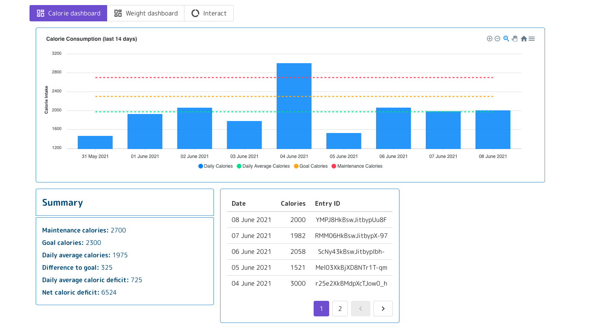
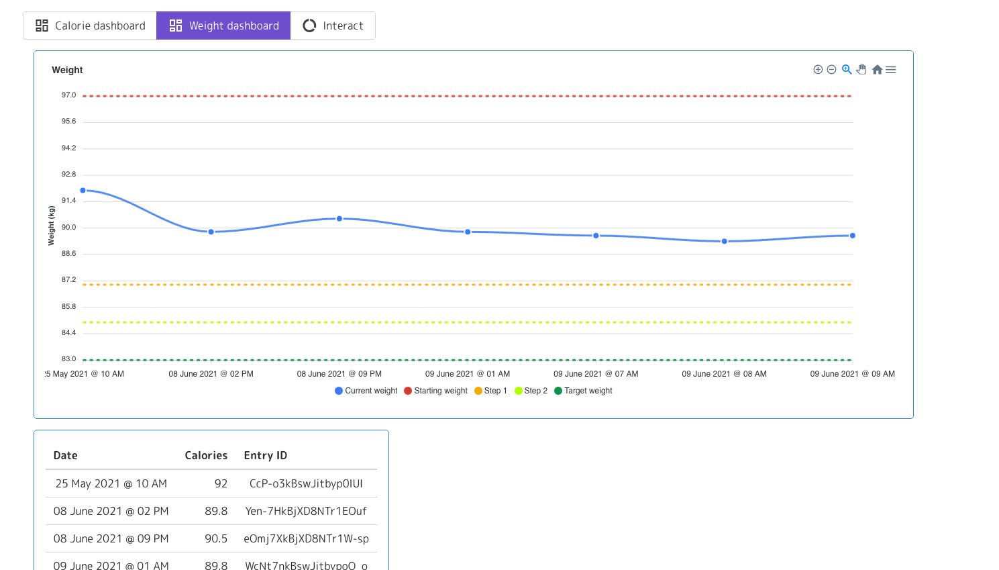

# road-to-83
An application I am building to help me track my nutrition and fitness goals including calorie uptake and weight loss.

## Motivation

I had the idea to build this application for some time now. There were a couple of reasons.
1) Most calorie tracking apps make you pay for the features I want and even then those features don't quite work how I want them to, so I decided why not make a 
bare bones version of what I want and just use that instead.
2) I wanted to keep up with my frontend development skills and namely my knowledge of the Vue JS framework. I can definitely say that with each project I feel more and more
comfortable with the basics and I think this app (despite a few quirks) came out better than my previous apps.
3) I wanted to use NGINX to serve my application and before I had used NGINX in a more toy set-up, but after working through this project I would say I have a better grasp
on the fundamentals of setting up an app that is served with NGINX. 
4) I wanted to collect my nutritional data and have a long-term historic view of it. Ideally I could also track macronutrients and other physiological quantities,
but that makes this significantly more involved and perhaps over time I will build this up to a be more fully-fledged nutrional/fitness assistant that can paint a picture
of how your physiological quantities evolve over time.


## Next Steps
At the moment, running this locally is not as easy as one might want it to be. There are some environment variables that need to be set and I have not made the process easy
for that... yet. Once I've ironed out all the kinks, I might do one of two things.

1) Set this up as an actual application (with user accounts and etc)
2) Make it as easy as possible to run this locally and add scripts if people want to deploy it on a platform like Heroku or Render with Docker.

Maybe I will do both, and have the self-deployed version be a reduced version of the full application, however that depends on how much time I have to continue working on this applicatio
and how much interest it garners from people that I know.


## Running Locally (with Docker)

At the moment the best way to run these services locally is to use Docker. For now you have to launch each service individually, but at some point I will add a Docker-compose file
to make that a bit easier. 

For now you can follow these steps.

```[bash]
git clone https://github.com/djvaroli/road-to-83 road-to-83/ # clone the repo
```

Build and run the app on port 8000 (you can set that to anything you want)
```[bash]
cd app/ && docker build -t roadTo83-app . && docker run -d --rm -p 8000 roadTo83-app # go into the app directory and build/run the docker container
```

To run the frontend you will need a `.env` file in the frontend directory with the base url. Simply create the following file
```[text]
# frontend/.env
VUE_APP_BASE_URL="http://127.0.0.1:8003"
```

You can also just do
```[bash]
cd frontend && touch .env && echo VUE_APP_BASE_URL="http://127.0.0.1:8000" >> .env
```

Build and run the frontend on port 8080 (you can set that to anything you want)
```[bash]
cd frontend/ && docker build -t roadTo83-frontend . && docker run -d --rm -p 8080 roadTo83-frontend # go into the app directory and build/run the docker container
```

At this point you should have a frontend part running on port 8080 and a backend part running on port 8000.

## Screenshots

This is what the app looks like now, but as time goes on and I come back to it, I hope to make this nicer, easier to use and also more mobile-friendly.



And the second dashboard



